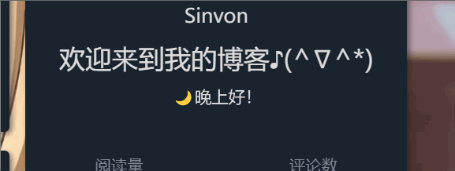

实现JS字体跳动



```html
<!DOCTYPE html>
<html>
<head>
    <meta charset="UTF-8">
    <!-- 设置网页标题 -->
    <title>Greeting Example with Time Fluctuation</title>
    <style>
        /* 样式用于动画 */
        @keyframes fluctuate {
            /* 开始和结束状态，元素正常大小 */
            0%, 100% {
                transform: scale(1);
            }
            /* 中间状态，元素放大 2 倍 */
            50% {
                transform: scale(2.0);
            }
        }
        /* 应用动画效果 */
        #greeting {
            animation: fluctuate 2s infinite;
        }
    </style>
</head>
<body>
<!-- 页面内容部分 -->
<h5>欢迎来到我的博客♪(^∇^*)</h5>
<p id="greeting"></p>

<script>
    // 获取要显示问候信息的元素
    var greetingElement = document.getElementById("greeting");

    // 获取当前时间
    var currentTime = new Date();
    var currentHour = currentTime.getHours();

    // 根据时间设置问候信息
    var greetingMessage;
    if (currentHour < 12) {
        greetingMessage = "🌅早上好！";
    } else if (currentHour < 18) {
        greetingMessage = "☀️下午好！";
    } else {
        greetingMessage = "🌙晚上好！";
    }

    // 将问候信息显示在页面上
    greetingElement.textContent = greetingMessage;
</script>
</body>
</html>
```
